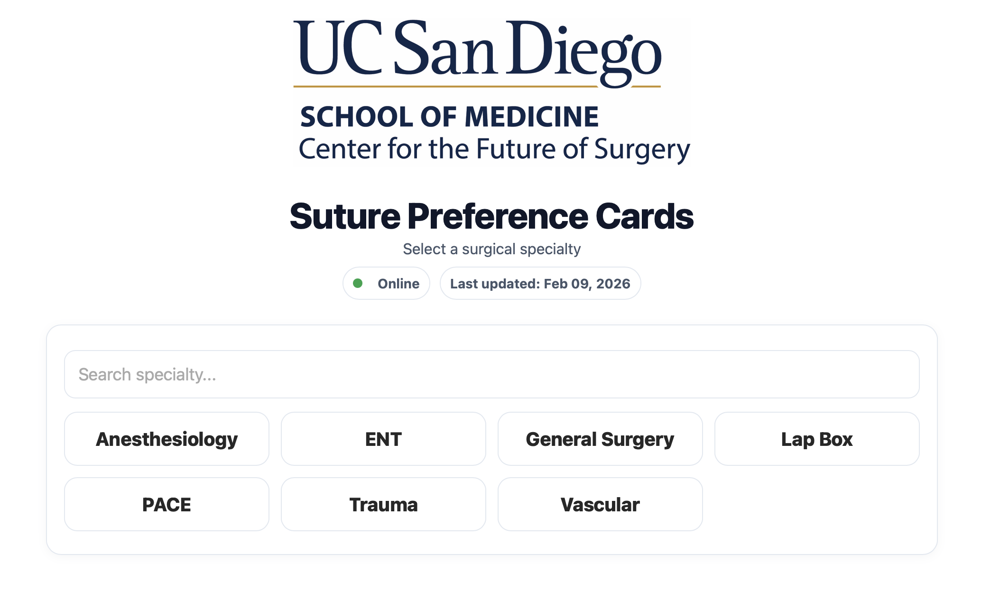
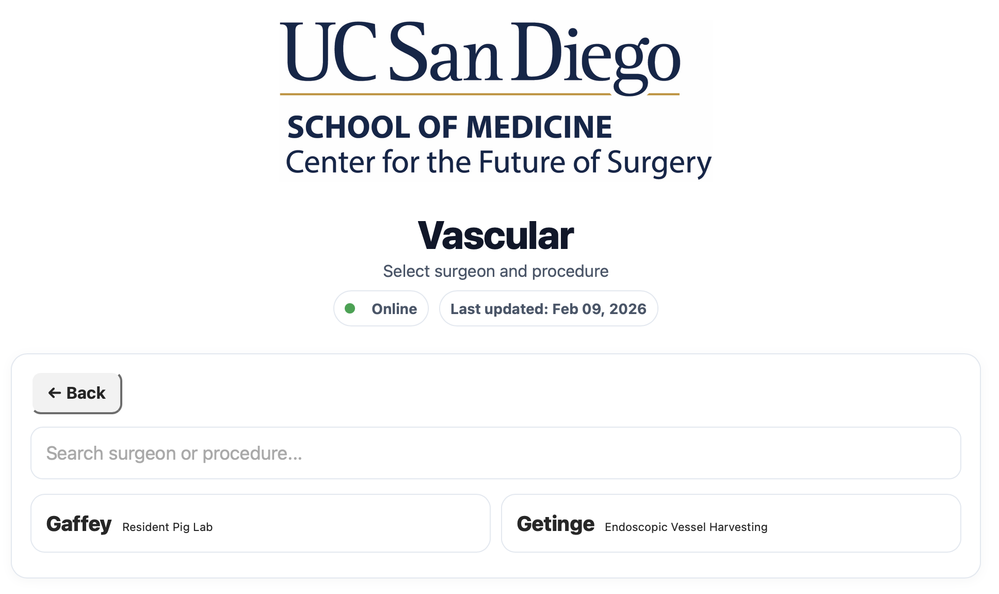
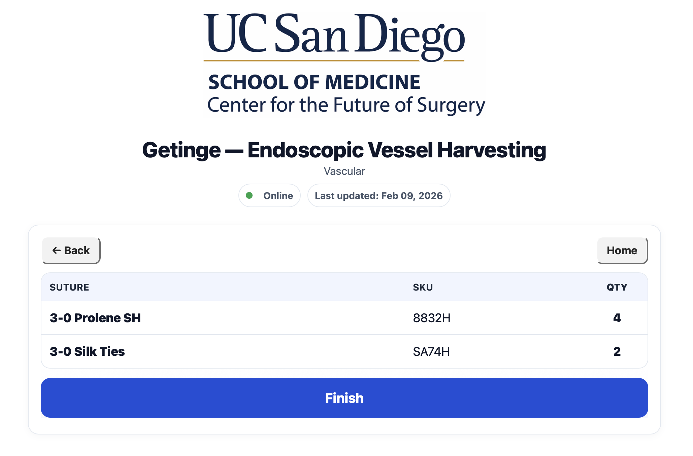

# Suture Preference Cards (Offline iPad Kiosk)

An iPad-optimized web application for displaying surgeon-specific suture
preference cards during surgical labs.

Designed to replace spreadsheet lookups with a fast, touch-friendly
workflow.

------------------------------------------------------------------------

## Flow

1)  Specialty list (start)
2)  Surgeon \| Procedure list (filtered by specialty)
3)  Preference card (Suture, SKU, Quantity) + Finish returns to start

Additional UX features: - Back navigation on all pages
- Online / Offline status indicator
- "Last updated" date display
- Version badge (bottom-right)
- Staff refresh (long-press logo)

------------------------------------------------------------------------

## Screenshots

### 1. Specialty Selection

---

### 2. Surgeon & Procedure Selection

---

### 3. Preference Card View

------------------------------------------------------------------------

## Run locally

npm install 
npm run dev

Open: http://localhost:3000

------------------------------------------------------------------------

## Deployment (Production)

Recommended: Vercel

Deployment flow: 1) Push changes to GitHub
2) Vercel auto-builds and deploys
3) Refresh kiosk (long-press logo)

------------------------------------------------------------------------

## Offline (iPad)

For best results, use Home Screen install:

1)  Deploy to HTTPS (Vercel recommended)
2)  Open site once on iPad Safari (online)
3)  Share → Add to Home Screen
4)  Launch from the icon
5)  (Optional) Enable Guided Access
6)  Turn on Airplane Mode and relaunch from the icon

Note: Initial load must occur while online.

------------------------------------------------------------------------

## Data

Source of truth:

public/data/preference_cards.csv

All preference cards are driven from this file.

No code changes required for routine updates.

------------------------------------------------------------------------

## Updating Preference Cards (CSV-only)

1.  Edit public/data/preference_cards.csv
2.  Save as CSV
    -   Do not rename the file
    -   Do not change column headers
3.  Commit + push:

git add public/data/preference_cards.csv git commit -m "Update suture
preference cards" git push

4.  Wait ~30--60 seconds for redeploy
5.  On iPad: long-press logo to refresh

------------------------------------------------------------------------

## Expected CSV Columns (Flexible Header Matching)

Required: - Specialty
- Surgeon
- Procedure Name (or Procedure / Lab)
- Suture Name (or Product Description / Suture)
- Quantity (or Amount)

Optional: - Description
- SKU (or Manufacturer SKU)

Header matching is flexible but consistent naming is recommended.

------------------------------------------------------------------------

## Versioning

Current version displayed in UI (bottom-right badge).

To bump version:

1.  Update package.json "version": "1.0.1"

2.  Commit and push.

------------------------------------------------------------------------

## Intended Use

-   Surgical lab staff
-   Lab coordinators
-   Surgical trainees

Platform: iPad (Safari or Home Screen install)

------------------------------------------------------------------------

## Non-Goals (Intentional Design Scope)

This application does NOT include:

-   PHI storage
-   User authentication
-   Backend database
-   Inventory tracking
-   Role-based permissions

The app is intentionally lightweight and CSV-driven for simplicity and
maintainability.

------------------------------------------------------------------------

## Maintenance Philosophy

-   CSV is the single source of truth
-   Git commit history serves as change log
-   Prioritize stability over feature expansion
-   Reassess new features only after real-world usage feedback

------------------------------------------------------------------------

Created by Jonathan Morales, SRA 2 NEX, Center for the Future of Surgery, University of California San Diego.
